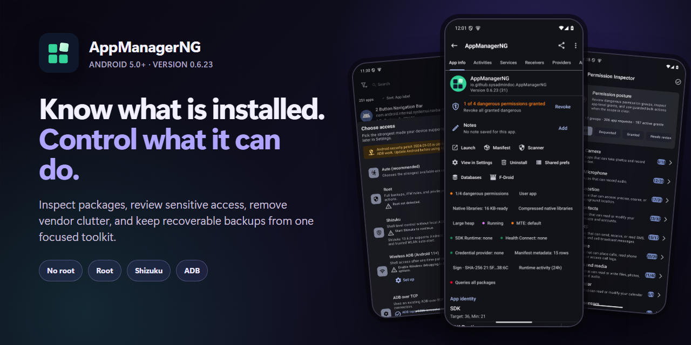
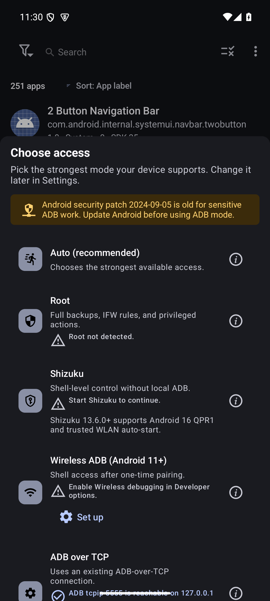
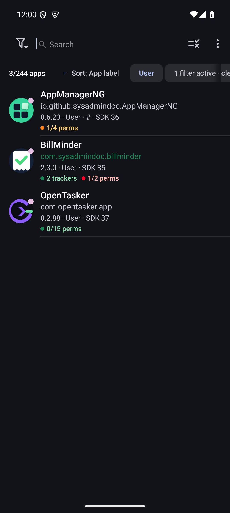
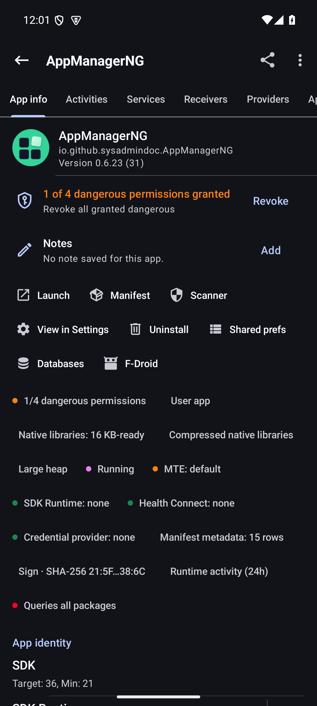
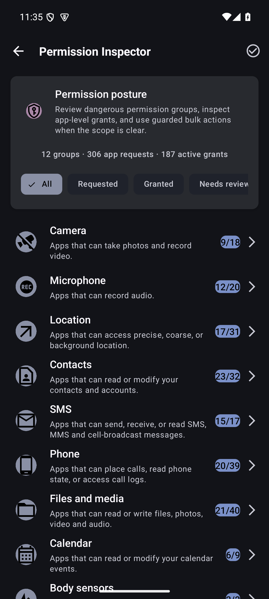
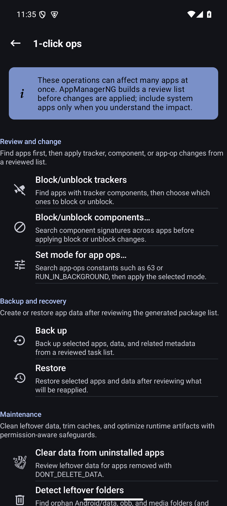
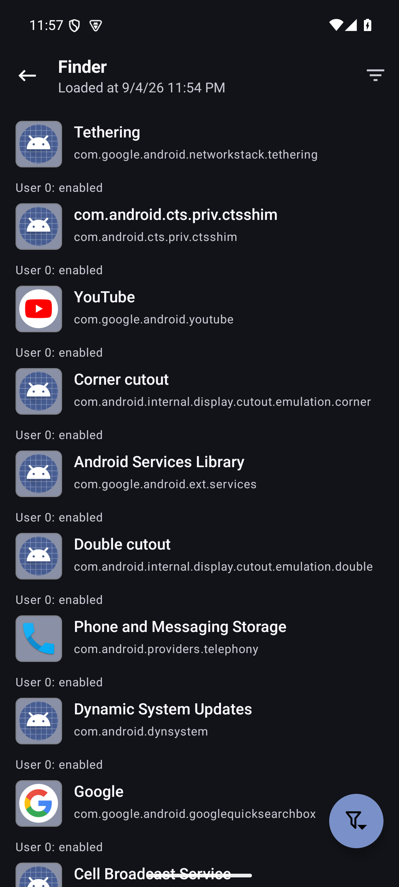

<!-- SPDX-License-Identifier: GPL-3.0-or-later OR CC-BY-SA-4.0 -->

<p align="center">
  
</p>

<h1 align="center">AppManagerNG</h1>

<p align="center">
  <strong>Understand every installed package. Take back control when you need it.</strong>
</p>

<p align="center">
  AppManagerNG brings package inspection, debloating, backups, permissions, and advanced Android tools into one app. Start without root, then choose a privileged mode when you need deeper access.
</p>

<p align="center">
  
  
  
  
  
  
  
</p>

<p align="center">
  <a href="https://github.com/SysAdminDoc/AppManagerNG/releases/latest/download/AppManagerNG-reproducible-full-release.apk"><strong>Download the full APK</strong></a>
  &nbsp;•&nbsp;
  <a href="https://github.com/SysAdminDoc/AppManagerNG/releases/latest">All release files</a>
  &nbsp;•&nbsp;
  <a href="https://github.com/SysAdminDoc/AppManagerNG/issues">Report a problem</a>
</p>

<p align="center">
  
</p>

## Android package control without the guesswork

Android exposes only a small part of each installed app. AppManagerNG gives you the fuller picture: components, permissions, AppOps, trackers, signatures, storage, usage, native libraries, and the package manifest. Actions show what will change before they run, and the app records enough detail to make failures understandable.

It is built for people who maintain their own devices, troubleshoot apps, or want a safer way to remove vendor clutter. There are no ads, analytics, telemetry, or bundled tracking SDKs.

## A closer look

<p align="center">
  
  
  
</p>

<p align="center">
  
  
  
</p>

## Why people use it

- **Find the odd app fast.** Finder combines package state, permissions, trackers, SDK level, installer, signature, storage, backup state, and native-library readiness in reusable queries.
- **Review access by permission.** Permission Inspector starts with Camera, Location, Contacts, Notifications, and other sensitive groups, then shows every app holding that access.
- **Make careful changes at scale.** One-click operations and profiles preview the selected packages before freezing, uninstalling, clearing, backing up, or applying rules.
- **Keep recovery options.** Back up APKs and app data where the selected access mode permits it. Encrypted snapshot bundles can carry rules, profiles, and preferences to another device.

## Pick the access mode that fits your device

AppManagerNG does not require root just to open and inspect your apps. More powerful actions need an Android privilege path.

| Mode | Best for | What it adds |
|---|---|---|
| **No root** | Everyday inspection and standard Android actions | Package details, manifests, exported components, permitted installs, reports, and Android-supported archiving |
| **Shizuku** | Stock devices with Wireless debugging | Access to supported system package APIs without rooting the device |
| **ADB** | Desktop-assisted work or dedicated devices | A privileged bridge for supported package, process, and file operations |
| **Root** | Full device administration | The broadest component, data, backup, AppOps, and system configuration control |

The access chooser reports what is ready on the current device. If a feature needs more privilege, AppManagerNG explains the requirement instead of silently doing nothing.

## What is included

### Inspect and investigate

- Rich package details for activities, services, receivers, providers, permissions, AppOps, signatures, shared libraries, storage, and usage
- Tracker and library scanning with evidence labels and exportable reports
- Manifest viewer, class viewer, intent tools, log viewer, running-process view, and native-library packaging checks
- Sideload diagnostics for Android restricted settings and installer failures

### Control and clean up

- Install APK, APKS, APKM, XAPK, split APK, and OBB packages
- Freeze, unfreeze, force-stop, clear data, clear cache, uninstall, and archive supported apps
- Debloater classifications, component rules, network policy controls, and battery optimization tools
- Batch actions, scheduled profiles, package-event triggers, and Tasker-compatible intents

### Back up and recover

- APK and app-data backup with rules, permissions, roles, and extras where the access mode allows it
- Encrypted archives using OpenPGP, RSA, ECC, or AES
- Import support for OAndBackup, Neo Backup, Swift Backup 3.0 to 3.2, and Titanium Backup
- Selective snapshot restore with a preview before anything is written

### Work directly on the device

AppManagerNG also includes a file manager, code editor, shared-preferences editor, terminal, app-usage explorer, and Quick Settings tiles for frequent actions.

## Install

Every release includes two signed universal APKs. Both support `armeabi-v7a`, `arm64-v8a`, `x86`, and `x86_64` on Android 5.0 and later.

| Build | Choose it when | Network posture |
|---|---|---|
| **Full** | You install from GitHub or Obtainium and want optional VirusTotal reports or debloat-list updates | Optional online features are available but remain off until enabled |
| **FLOSS** | You want the smallest network surface or use an F-Droid-style distribution | Third-party online report features are removed at compile time |

Download the [full APK](https://github.com/SysAdminDoc/AppManagerNG/releases/latest/download/AppManagerNG-reproducible-full-release.apk) or the [FLOSS APK](https://github.com/SysAdminDoc/AppManagerNG/releases/latest/download/AppManagerNG-reproducible-floss-release.apk).

### Automatic updates with Obtainium

Add `https://github.com/SysAdminDoc/AppManagerNG` to [Obtainium](https://github.com/ImranR98/Obtainium). The optional [preconfigured Obtainium file](docs/distribution/obtainium-config.json) pins the release pattern and skips prereleases.

## Privacy and release trust

The default FLOSS build has no ads, analytics, telemetry upload, or optional third-party report traffic. Broad package visibility is necessary for an on-device package manager and is documented in the [package visibility note](docs/distribution/package-visibility.md).

Releases are built twice from clean checkouts. Publication stops unless the APKs are byte-identical. Each release includes checksums, a CycloneDX SBOM, dependency review evidence, and a receipt tying the artifacts to the source commit.

The signing certificate SHA-256 fingerprint is:

```text
21:5F:B4:70:63:2E:A6:CD:59:A4:BA:AB:35:0A:9E:0B:99:AD:11:0F:DD:FA:F5:A9:EA:64:61:E5:D0:C2:38:6C
```

Compare it with the stable record in [docs/fingerprints.txt](docs/fingerprints.txt) or verify the APK with [AppVerifier](https://github.com/soupslurpr/AppVerifier). The [reproducible build guide](docs/distribution/reproducible-builds.md) explains the local release gate.

## Build from source

The project uses Java, Android Views, Gradle 9.7, and AGP 9.3.1. Android SDK 37 and NDK 28.2.13676358 are the current pins.

```bash
git clone --recurse-submodules https://github.com/SysAdminDoc/AppManagerNG.git
cd AppManagerNG
./gradlew assembleFlossDebug
```

See [BUILDING.rst](BUILDING.rst) for the complete toolchain and signed-release steps. Contributions are covered in [CONTRIBUTING.md](CONTRIBUTING.md), and release history lives in [CHANGELOG.md](CHANGELOG.md).

## Project history

AppManagerNG is a maintained continuation of Muntashir Al-Islam's [App Manager](https://github.com/MuntashirAkon/AppManager). It began from upstream commit [`3d11bcb`](https://github.com/MuntashirAkon/AppManager/commit/3d11bcbc399d3a4f995b544e26d86bd80487fd32) on April 30, 2026. The upstream project and its contributors supplied the foundation. This continuation focuses on a clearer interface and current Android behavior, backed by locally verified releases.

## License

AppManagerNG is released under **GPL-3.0-or-later**. See [COPYING](COPYING) for the full license. Per-file SPDX headers and the `LICENSES/` directory preserve the licenses for bundled work.
